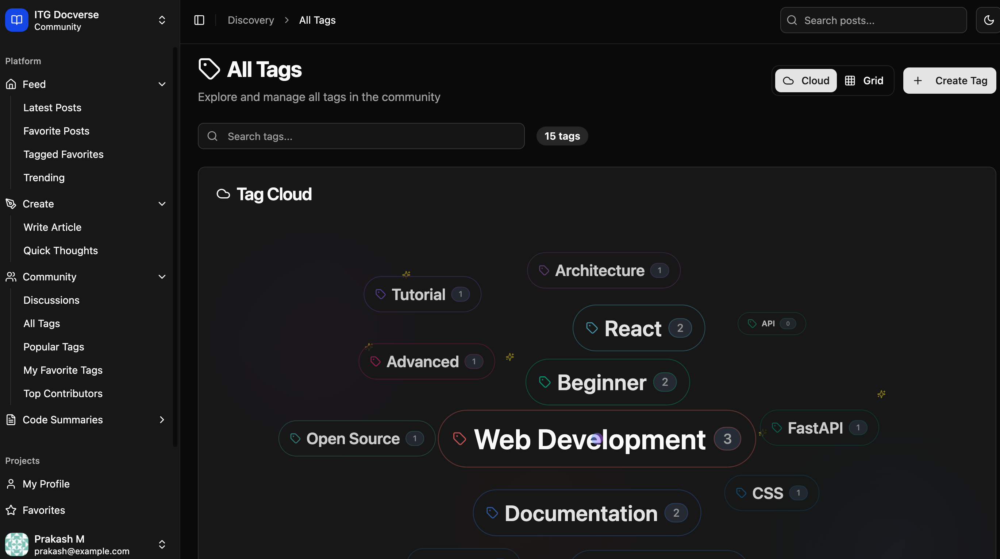
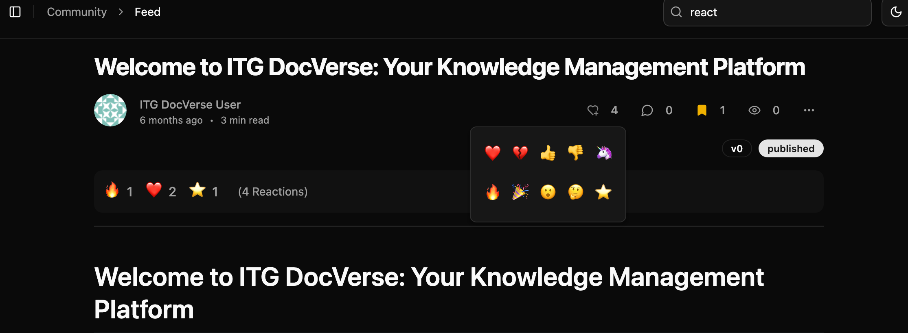

*This is a submission for the [Redis AI Challenge](https://dev.to/challenges/redis-2025-07-23): Beyond the Cache*.

## What I Built

Meet **ITG DocVerse** - an internal knowledge-sharing platform for organizations, inspired by the excellent community-driven approach of DEV.to. I wanted to create something that teams could use to document projects, share insights, and collaborate - but with the power of Redis driving everything under the hood.

The platform allows team members to:
- 📝 Share posts, thoughts, and auto generated documents from git repos (Work in progress)
- 🔍 Search content using AI-powered semantic search
- 💬 Engage with discussions and comments  
- 🏷️ Organize content with tags and categories
- 👤 Build profiles and connect with colleagues

What makes this special is the architecture - I used this hackathon as an opportunity to explore Redis as the complete backbone of the application. From storing user profiles to powering semantic search with vector embeddings, this project demonstrates how Redis can serve as a comprehensive data platform that scales from small teams to enterprise-wide knowledge bases.

## Demo

🚀 **Live Demo**: [http://localhost:5173](http://localhost:5173)  
📚 **API Documentation**: [http://localhost:8000/docs](http://localhost:8000/docs)

### Screenshots

#### Main Dashboard & Content Feed

*The main feed showing posts with real-time interactions and engagement*


*Detailed post view with markdown rendering and discussion section*

#### Content Creation & Management

*Rich markdown editor for creating technical documentation*


*Quick thought sharing interface for team communication*

#### AI-Powered Search & Discovery

*Semantic search finding relevant content even without exact keyword matches*


*AI-generated code summaries and documentation from repositories*


*Automated code analysis and summary generation*

#### Tag-Based Organization

*Visual tag cloud for content discovery and organization*


*Grid-based tag organization for better navigation*

#### User Engagement & Analytics

*Real-time reactions and engagement tracking*


*Community leaderboard and contributor recognition*


*Comprehensive user profiles with activity tracking*

#### Redis Data Architecture in Action

*Redis Insight showing our multi-model data structure*


*User profiles stored as Redis Hash sets*


*Post content stored as Redis JSON documents*


*Tag organization using Redis sorted sets*


*Vector embeddings stored for semantic search*


*Content chunking strategy for large documents*

## How I Used Redis 8

This project leverages Redis as the primary backbone - serving as our **database**, **search engine**, and **real-time data platform**. The hackathon gave me the perfect excuse to see how far I could push Redis beyond traditional caching. Here's how:

### 🗄️ Redis as Primary Database

Rather than reaching for PostgreSQL or MySQL, I decided to architect the application around Redis data structures to see what was possible:

#### User Management with Hash Sets
```redis
# User profiles stored as Redis hashes
HSET user:prakash88 
  id "ac2402cf-9a84-46a5-8484-d32400e7a18d"
  username "prakash88" 
  display_name "Prakash M"
  email "prakash@example.com"
  bio "Full-stack developer passionate about Redis"
  avatar_url "https://..."
  joined_date "2025-01-15T10:30:00Z"
```

#### Content Storage with JSON Documents
```redis
# Posts stored as Redis JSON with rich metadata
JSON.SET post:technical-architecture $ '{
  "id": "post-technical-architecture",
  "title": "Building with Redis: Beyond the Cache",
  "content": "# How Redis Powers Modern Applications...",
  "author_id": "ac2402cf-9a84-46a5-8484-d32400e7a18d",
  "post_type": "posts",
  "tags": ["redis", "architecture", "database"],
  "created_at": "2025-01-15T14:22:00Z",
  "read_time": 8
}'
```

#### Indexing with Sorted Sets for Performance
```redis
# Time-based post feeds using sorted sets
ZADD posts:by_date 1737890520 "post-technical-architecture"
ZADD posts:by_tag:redis 1737890520 "post-technical-architecture" 
ZADD user:prakash88:posts 1737890520 "post-technical-architecture"
```

### 🧠 AI-Powered Vector Search

The real magic happens with Redis's vector search capabilities. I built a semantic search engine that understands context, not just keywords:

#### Vector Embeddings Storage
```redis
# 768-dimensional embeddings stored efficiently
HSET search:vector:post-architecture-chunk-0
  vector "\x3e\x9a\x12\x40..."  # Binary encoded float32 array
  metadata '{"post_id": "post-architecture", "content": "Redis serves as...", "title": "Technical Architecture"}'

# Index management
SADD search:chunks "post-architecture-chunk-0"
```

#### The Search Pipeline
1. **Content Chunking**: Break posts into semantic chunks (~500 words)
2. **Embedding Generation**: Use Ollama's `nomic-embed-text` model to create 768-dim vectors
3. **Redis Storage**: Store vectors as binary data with metadata
4. **Similarity Search**: Cosine similarity against all stored vectors
5. **Results Ranking**: Return top matches with relevance scores

### 📊 Data Architecture in Redis

Here's how I structured the data across Redis:

```
Redis Database Structure
├── Users (Hashes)
│   ├── user:{username} → Profile data
│   └── user:{id}:posts → User's post references
│
├── Posts (JSON Documents)  
│   ├── post:{id} → Full post content
│   ├── posts:by_date → Time-ordered feed
│   └── posts:by_tag:{tag} → Tag-based organization
│
├── Comments (Hashes)
│   ├── comment:{id} → Comment data
│   └── post:{id}:comments → Post comment references
│
├── Vector Search (Mixed Types)
│   ├── search:chunks → Set of all chunk IDs
│   ├── search:vector:{chunk_id} → Hash with vector + metadata
│   └── search:metadata:{post_id} → Post search metadata
│
└── Authentication (Strings)
    └── session:{token} → JWT session data
```

#### Redis Data Model Visualization


#### Data Flow for Search Operations


#### Redis Key Patterns Used

| Pattern | Type | Purpose | Example |
|---------|------|---------|---------|
| `user:{username}` | Hash | User profile storage | `user:prakash88` |
| `user:{id}:posts` | Sorted Set | User's posts by time | `user:ac24...18d:posts` |
| `post:{id}` | JSON | Complete post content | `post:welcome-guide` |
| `posts:by_date` | Sorted Set | Global feed timeline | `posts:by_date` |
| `posts:by_tag:{tag}` | Sorted Set | Tag-based organization | `posts:by_tag:redis` |
| `search:vector:{chunk_id}` | Hash | Vector + metadata | `search:vector:post-arch-chunk-0` |
| `search:chunks` | Set | All searchable chunks | `search:chunks` |
| `comment:{id}` | Hash | Comment data | `comment:cm1` |
| `post:{id}:comments` | List | Post's comments | `post:welcome-guide:comments` |

### ⚡ Performance Optimizations

Redis's speed shines through several optimizations:

#### 1. **Compound Queries with Pipeline**
```python
# Fetch user, their posts, and engagement data in one roundtrip
pipe = redis_client.pipeline()
pipe.hgetall(f"user:{username}")
pipe.zrevrange(f"user:{user_id}:posts", 0, 19)  # Latest 20 posts
pipe.scard(f"user:{user_id}:followers")
results = pipe.execute()
```

#### 2. **Smart Caching with Expiration**
```python
# Cache frequently accessed data with TTL
redis_client.setex(f"popular:posts:today", 3600, json.dumps(trending_posts))
```

#### 3. **Memory-Efficient Vector Storage**
Instead of storing vectors as JSON arrays, I serialize them as binary:
```python
# Convert float array to compact binary format
vector_bytes = np.array(embedding, dtype=np.float32).tobytes()
redis_client.hset(f"search:vector:{chunk_id}", "vector", vector_bytes)
```

### 🔄 Future Real-Time Features 

The current architecture is designed to support additional Redis capabilities in the roadmap:
- **Chatbot Integration**: A knowledge-base powered chatbot using the existing vector search
- **Redis Streams**: For storing and processing chat queries and user interactions
- **Pub/Sub**: For real-time chat notifications and live updates
- **Advanced Analytics**: Using the engagement data already being collected

## The "Aha!" Moments

Building this taught me that Redis isn't just fast storage - it's a complete data platform:

1. **Easy Migration**: Originally started with SQLite, but adding Redis support was surprisingly smooth thanks to our service layer architecture
2. **JSON Support**: Redis JSON made complex document storage trivial - no more complex table joins!
3. **Vector Search**: No need for separate vector databases like Pinecone - Redis handled it natively
4. **Multi-Model Flexibility**: Hash sets for profiles, sorted sets for feeds, JSON for posts - all in one system
5. **Atomic Operations**: Complex updates in single commands instead of transaction blocks
6. **Memory Efficiency**: Surprisingly good performance even with a 12-chunk vector index
7. **Scalability**: What started as a simple SQLite app easily scaled to support Redis's advanced features

## Technical Stack

- **Backend**: FastAPI (Python) with Redis as the primary database
- **Frontend**: React + TypeScript with Vite
- **UI Framework**: Tailwind CSS + shadcn/ui components
- **AI**: Ollama for local embeddings (nomic-embed-text model)
- **Search**: Redis vector operations with cosine similarity
- **Authentication**: JWT tokens stored in Redis
- **Deployment**: Docker-compose for easy setup

## What's Next?

This hackathon project was a great exploration of Redis's potential as an application backbone. I would like to explore other Redis capabilities for the :

- **AI Chatbot**: Knowledge-base powered assistant using existing vector search
- **Real-time Chat**: Redis Streams for storing chat history and Pub/Sub for live messaging
- **Advanced Analytics**: Redis TimeSeries for tracking user engagement patterns
- **Geographic Features**: Redis GEO commands for location-based content
- **Enhanced Search**: Combining full-text search with vector similarity

## Try It Yourself

```bash
# Clone and run with Docker
git clone https://github.com/ITechGenie/itg-docverse
cd itg-docverse
docker-compose up -d

# Or run locally
cd apis && pip install -r requirements.txt && python main.py
cd app && npm install && npm run dev
```

Redis isn't just about caching anymore - it's a powerful platform for building modern applications. ITG DocVerse shows what's possible when you use Redis as your application's backbone.

*The hackathon challenge gave me the perfect excuse to explore these capabilities!* 🚀

<!-- Team Submissions: Please pick one member to publish the submission and credit teammates by listing their DEV usernames directly in the body of the post. -->

<!-- Don't forget to add a cover image (if you want). -->

<!-- Thanks for participating! -->

<!--  ⚠️ By submitting this entry, you agree to receive communications from Redis regarding products, services, events, and special offers. You can unsubscribe at any time. Your information will be handled in accordance with [Redis's Privacy Policy](https://redis.io/legal/privacy-policy/). -->